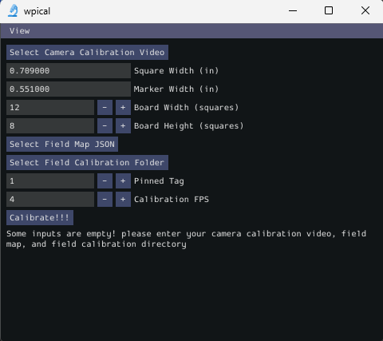
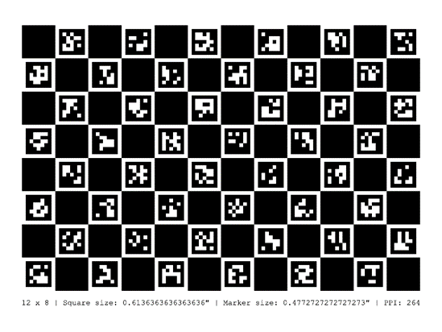
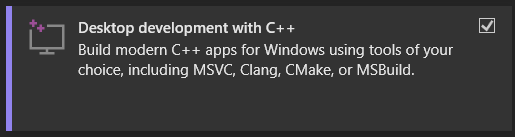

# WPIcal


WPIcal is a tool used to “calibrate” or empirically measure the position and orientation of the Apriltags on FRC fields. This tool was inspired by team 1538, The Holy Cows, who created a command-line tool to perform this field calibration: https://github.com/TheHolyCows/cowlibration-field. WPIcal aims to streamline field calibration by combining the needed camera calibration with the field calibration process into a user-friendly application.

## Overview
WPIcal measures the positions of the Apriltags on the field relative to each other. By selecting a tag to “pin” or use the default position for, WPIcal will create a field map, in which the other tags on the field will be moved to their measured positions relative to the pinned tag.

### Calibration Process
* Print out a copy of the ChArUco board used to calibrate your camera. (if using MRcal, use a regular checkerboard pattern)

    
* Take a short video of the calibration board with your camera, make sure the board is on a flat, non-reflective surface.
* Take videos of the Apriltags you would like to calibrate.
* Ensure field calibration videos are in a separate directory on your system
* Run WPIcal application:
    * Select your camera calibration video and fill in values or select camera intrinsics JSON.
    * Select the ideal Apriltag field map .json file provided by WPIlib.
    * Select the field video directory.
    * Select the pinned tag. It must be a tag that is in the calibration video
    * Select the processing FPS - Must be slower than the field calibration video FPS
    * Calibrate!
    * Upload your .json file to https://tools.limelightvision.io/map-builder to view your new field map!
    * You can now download your new field map and use it in your robot code or on your vision co-processors.

## Build
If you wish to build WPIcal from source or want to contribute, these steps will help you get started. This project uses CMake as its build tool and vcpkg as its dependency manager, so make sure you have those installed on your system.

### Windows
* Ensure you have [Visual Studio](https://visualstudio.microsoft.com/) installed with c++ desktop development.

    
* Run the following commands:
    ```
    git clone --recurse-submodules https://github.com/ElliotScher/wpical.git
    cd WPIcal
    ```
* To configure the cmake project, run:
    ```
    cmake -S . -B build -G "Visual Studio 17 2022" -T ClangCl -A x64 -DVCPKG_ROOT=<path/to/vcpkg>
    ```
* To build the cmake project, run: ```cmake --build build --config Release``` from inside the WPIcal root directory.

### Linux
* Clone the WPIcal git repository:
    ```
    git clone --recurse-submodules https://github.com/ElliotScher/wpical.git
    ```
* Run the following commands:
    ```
    cd WPIcal
    chmod +x setup.sh
    sudo ./setup.sh
    ```
* To build the cmake project, run: ```cmake --build build --config Release``` from inside the WPIcal root directory.
